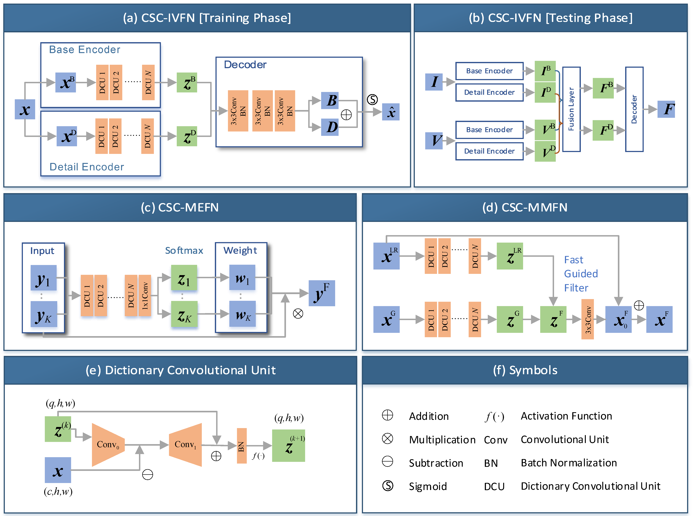

# Deep-CSC-Networks-For-Image-Fusion
Deep Convolutional Sparse Coding Networks for Image Fusion. [arxiv](https://arxiv.org/abs/2005.08448)

[Shuang Xu *](https://xsxjtu.github.io/), [Zixiang Zhao *](https://www.researchgate.net/profile/Zixiang_Zhao5/), [Yicheng Wang](https://www.researchgate.net/profile/Wang_Yicheng4), Kai Sun, [Chunxia Zhang](https://www.researchgate.net/profile/Chun_Xia_Zhang/), [Junmin Liu](http://gr.xjtu.edu.cn/web/junminliu/), [Jiangshe Zhang](http://gr.xjtu.edu.cn/web/jszhang/). (* equal contributions)

## Abstract
Image fusion is a significant problem in many fields including digital photography, computational imaging and remote sensing, to name but a few. Recently, deep learning has emerged as an important tool for image fusion. This paper presents three deep convolutional sparse coding (CSC) networks for three kinds of image fusion tasks (i.e., infrared and visible image fusion, multi-exposure image fusion, and multi-modal image fusion), where the CSC model and the iterative shrinkage and thresholding algorithm are generalized into dictionary convolution units. As a result, all hyper-parameters in the CSC model are learned from data. Our extensive experiments and comprehensive comparisons reveal the superiority of the proposed networks with regard to quantitative evaluation and visual inspection.

## CSC Unfolding
The CSC optimizes the following problem,

where  is a hyperparameter, * denotes the convolution operator,  is the sparse feature map (or say, code) and  is a sparse regularizer. This problem can be solved by ISTA, and its updating rule is as below,

We replace some operations with deep neural networks' elements and rewritten the updating rule, that is, 

The above equation is called as the dictnary convolutional unit (DCU).

## Network Structure

